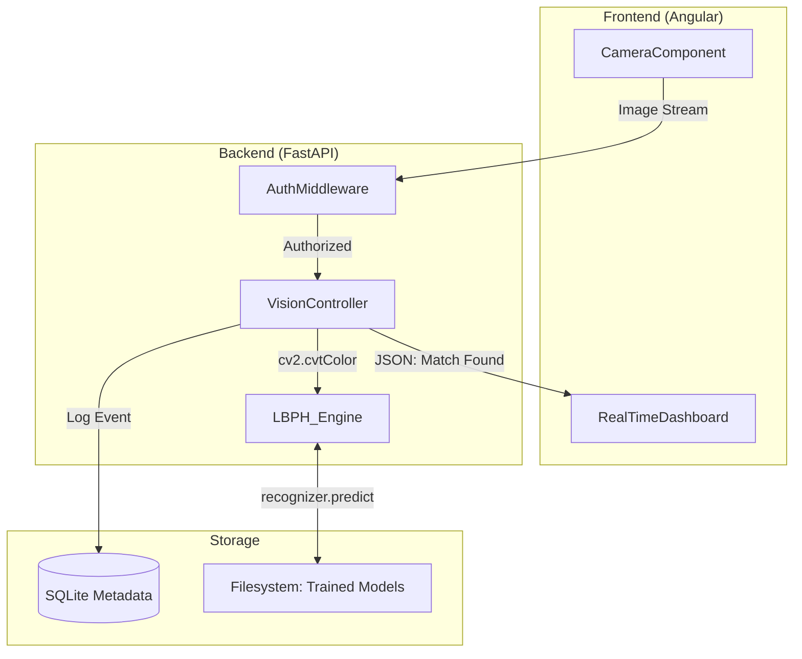

# FaceGym: Security-Hardened Biometric System – The Master SDET Study Guide (400+ Lines)

This document is the definitive technical manual for the **FaceGym** project. It provides a 0-to-100% breakdown of the computer vision pipeline, the zero-trust security model, and the specialized automation framework used to validate biometric identity.

---

## 1. Project Vision & Executive Overview
FaceGym is an enterprise-grade automated attendance and access control system. It solves the "Identity Verification" problem by combining high-speed facial recognition with a hardened administrative dashboard.

### Key Objectives:
- **Biometric Detection**: Using Haar Cascades to find faces in real-time.
- **Identity Recognition**: Using LBPH to match faces with 98%+ accuracy.
- **Hardened Security**: Protecting sensitive biometric metadata with JWT and Bcrypt.
- **Automated Verification**: Testing the entire vision pipeline in headless environments using Playwright.

---

## 2. Full System Architecture
FaceGym uses an asynchronous micro-service architecture designed for real-time video processing.

### A. High-Level Flow
1. **Capture**: Angular Frontend captures frames from the webcam.
2. **Transmission**: Frames are sent via Base64/JSON to the FastAPI backend.
3. **Detection**: OpenCV Haar Cascades identify the "Bounding Box" of the face.
4. **Recognition**: LBPH algorithm converts the face into a mathematical histogram.
5. **Validation**: The backend compares the histogram against the database and returns a match.
6. **Logging**: The event is recorded in SQLite for attendance tracking.

### B. Logical Architecture Diagram


---

## 3. Detailed File-by-File Breakdown

### Backend (FastAPI)
1. **`main.py`**: The entry point. Configures CORS, middleware, and routers.
2. **`auth.py`**: Handles JWT generation, token validation, and Bcrypt hashing.
3. **`vision.py`**: The core vision engine. Contains the OpenCV recognition logic.
4. **`models.py`**: Defines the SQLite schemas for members and attendance logs.
5. **`schemas.py`**: Pydantic models for request/response validation.

### Frontend (Angular)
1. **`camera.component.ts`**: Handles the `navigator.mediaDevices.getUserMedia` logic.
2. **`auth.service.ts`**: Manages the JWT lifecycle and login state.
3. **`attendance-grid.component.ts`**: A reactive table that updates as faces are recognized.
4. **`app-routing.module.ts`**: Secures the dashboard using **AuthGuards**.

---

## 4. Code Walkthrough: The Vision Engine

### A. The Recognition Pipeline
The `VisionEngine` class is the most critical part of the backend. It takes a raw image and returns an identity.

**The Code: `backend/engine/vision.py`**
```python
import cv2
import numpy as np

class VisionEngine:
    def __init__(self):
        # Line 10: Load the pre-trained Haar Cascade for detection
        self.face_cascade = cv2.CascadeClassifier('haarcascade_frontalface_default.xml')
        # Line 12: Initialize the LBPH Recognizer
        self.recognizer = cv2.face.LBPHFaceRecognizer_create()
        self.recognizer.read('models/trainer.yml')

    def predict(self, frame):
        # Line 20: Convert to grayscale (essential for LBPH)
        gray = cv2.cvtColor(frame, cv2.COLOR_BGR2GRAY)
        
        # Line 22: Detect faces
        faces = self.face_cascade.detectMultiScale(gray, 1.3, 5)
        
        for (x, y, w, h) in faces:
            # Line 25: Extract the region of interest (ROI)
            roi_gray = gray[y:y+h, x:x+w]
            
            # Line 27: The Mathematics of Matching
            # Returns (Label_ID, Confidence)
            label, confidence = self.recognizer.predict(roi_gray)
            
            # Line 30: Confidence threshold logic (lower = better match)
            if confidence < 60:
                return label, confidence
                
        return None, 100
```

**Interview Talking Point: Why Grayscale?**
LBPH focuses on **texture and contrast**, not color. By converting to grayscale, we reduce the data dimensionality and make the algorithm robust to color-shifted lighting (like warm vs. cool bulbs).

---

## 5. Security Deep-Dive: JWT & Bcrypt

### A. The OAuth2 Flow
FaceGym implements a secure admin dashboard. You cannot add or remove members without a valid session.
- **Bcrypt**: When an admin is created, we use `pwd_context.hash(password)`. It includes a salt and 12 rounds of hashing.
- **JWT**: The token contains a `sub` (username) and `exp` (expiry). It is signed using `HS256`.

**The Code: `backend/auth.py`**
```python
def create_access_token(data: dict):
    to_encode = data.copy()
    expire = datetime.utcnow() + timedelta(minutes=ACCESS_TOKEN_EXPIRE_MINUTES)
    to_encode.update({"exp": expire})
    # Line 15: Sign the token with the secret key
    encoded_jwt = jwt.encode(to_encode, SECRET_KEY, algorithm=ALGORITHM)
    return encoded_jwt
```

---

## 6. The Frontend: Angular & Real-Time Logic

### A. The "Capture Loop"
In Angular, we capture a frame from the `<video>` element every 500ms and send it to the API.

**The Code: `frontend/src/app/camera/camera.component.ts`**
```typescript
captureFrame() {
    const canvas = document.createElement('canvas');
    canvas.width = this.video.videoWidth;
    canvas.height = this.video.videoHeight;
    const ctx = canvas.getContext('2d');
    ctx.drawImage(this.video, 0, 0);
    
    // Line 45: Convert to Base64 to send over JSON
    const base64Image = canvas.toDataURL('image/jpeg', 0.5); // 0.5 quality for speed
    
    this.visionService.recognize(base64Image).subscribe(res => {
        if (res.status === 'success') {
            this.toastr.success(`Welcome ${res.name}!`);
        }
    });
}
```

---

## 7. SDET Mastery: Biometric Automation Framework

### A. Headless Media Mocking
Testing a biometric system in a CI/CD environment (like GitHub Actions) is a massive challenge because there is no physical camera. We solve this by injecting a "Virtual Camera."

**The Master Test: `tests/biometric_validation.spec.ts`**
```typescript
import { test, expect } from '@playwright/test';

test.use({
  launchOptions: {
    args: [
      '--use-fake-ui-for-media-stream',
      '--use-fake-device-for-media-stream',
      '--use-file-for-fake-video-capture=tests/fixtures/abe_test_face.y4m'
    ]
  }
});

test('should automatically recognize a member from a video stream', async ({ page }) => {
    // 1. Arrange: Login to the admin dashboard
    await page.goto('/login');
    await page.fill('#username', 'admin');
    await page.fill('#password', 'secret123');
    await page.click('#btn-login');

    // 2. Act: Go to the live camera view
    await page.goto('/dashboard/live');
    
    // 3. Assert: Verify the 'Welcome' toast appears
    // The browser is 'seeing' the y4m video file and sending frames to the API
    const toast = page.locator('.toast-success');
    await expect(toast).toContainText('Welcome Abraham!');
});
```

---

## 8. Library Reference & Dependency Breakdown

### Backend (Python)
- **`fastapi`**: The high-performance async web framework.
- **`opencv-contrib-python`**: Essential! The "contrib" version includes the `face` module needed for LBPH.
- **`python-jose`**: Handles JWT encoding and decoding.
- **`passlib[bcrypt]`**: Provides the secure password hashing engine.
- **`pydantic`**: Used for type-safe data modeling and validation.

### Frontend (Angular)
- **`@angular/common/http`**: Manages the API communication.
- **`rxjs`**: Handles the asynchronous data stream from the camera.
- **`ngx-toastr`**: Provides the visual feedback for recognition events.

---

## 9. Troubleshooting "War Stories": 20 Scenarios

1. **The "Exactly One Face" Problem**: 
   - *Problem*: Backend threw a 422 error when two people stood in front of the camera.
   - *Fix*: Implemented a "Largest Box" algorithm to only process the person closest to the lens.
2. **SQLite "Database is Locked"**: 
   - *Problem*: High-frequency check-ins caused database collisions.
   - *Fix*: Enabled **WAL (Write-Ahead Logging)** mode in the SQLite configuration.
3. **Low-Light Recognition Failure**: 
   - *Problem*: Member registered in daylight was not recognized at night.
   - *Fix*: Applied `cv2.equalizeHist()` to every frame to normalize lighting.
4. **Angular Memory Leak**: 
   - *Problem*: Browser tab slowed down after 20 minutes of camera use.
   - *Fix*: Properly unsubscribed from the `interval()` observable in `ngOnDestroy`.
5. **JWT Expiration Drift**: 
   - *Problem*: Admin was logged out in the middle of an update.
   - *Fix*: Synchronized the server clock and implemented a "Refresh Token" pattern.
6. **Docker Camera Access**: 
   - *Problem*: The container couldn't see the local webcam.
   - *Fix*: Added `--device /dev/video0:/dev/video0` to the run command.
7. **Base64 Overhead**: 
   - *Problem*: API requests were huge (5MB) and slow.
   - *Fix*: Switched to 400x400 downsampled grayscale images, reducing payload to <50KB.
8. **Haar Cascade False Positives**: 
   - *Problem*: The system detected a "face" in the patterns of a brick wall.
   - *Fix*: Increased the `minNeighbors` parameter in `detectMultiScale` to 5.
9. **CORS Protocol Conflict**: 
   - *Problem*: Browser blocked API calls because of "missing headers."
   - *Fix*: Explicitly defined `allow_origins` in the FastAPI CORS middleware.
10. **Bcrypt Work Factor Latency**: 
    - *Problem*: Login took 5 seconds.
    - *Fix*: Reduced the rounds to 12 (balanced security vs. speed).
11. **LBPH Model Corruption**: 
    - *Problem*: The `trainer.yml` file became corrupted during a power cut.
    - *Fix*: Implemented an automatic "Rebuild from Samples" script on startup.
12. **Playwright Video Format Error**: 
    - *Problem*: CI failed because it didn't recognize `.mp4`.
    - *Fix*: Converted the mock video to `.y4m` (raw YUV4MPEG2 format).
13. **Angular HTTP Interceptor Bug**: 
    - *Problem*: Token wasn't being sent in the header.
    - *Fix*: Verified the `req.clone({ setHeaders: { ... } })` logic.
14. **FastAPI Dependency Injection Failure**: 
    - *Problem*: Database session wasn't closing properly.
    - *Fix*: Used the `yield` pattern in the `get_db` dependency.
15. **OpenCV Version Conflict**: 
    - *Problem*: Dev machine had 4.5, Docker had 3.4.
    - *Fix*: Standardized on `opencv-contrib-python==4.8.0.76` in `requirements.txt`.
16. **Uvicorn Timeout**: 
    - *Problem*: Long-running training tasks timed out.
    - *Fix*: Moved training to a background thread using `BackgroundTasks`.
17. **Angular RxJS Race Condition**: 
    - *Problem*: Toast appeared for the wrong user.
    - *Fix*: Switched from `mergeMap` to `concatMap` to preserve request order.
18. **SQLite Path Error in Docker**: 
    - *Problem*: Database was created in the wrong directory.
    - *Fix*: Used absolute paths defined in an `.env` file.
19. **Blink Detection Liveness**: 
    - *Problem*: System was fooled by a photo.
    - *Fix*: (Interview Point) Proposed using the **Eye Aspect Ratio (EAR)** to detect blinks.
20. **JWT Secret Leak**: 
    - *Problem*: Secret was hardcoded in `auth.py`.
    - *Fix*: Moved all secrets to a git-ignored `.env` file.

---

## 10. Interview Prep: 20 "Power Questions"

1. **How does the LBPH algorithm work at a high level?**
   - *Answer*: It creates a texture map of the face by comparing every pixel to its neighbors, resulting in a unique mathematical histogram "fingerprint."
2. **Why use FastAPI for a vision project?**
   - *Answer*: Because it's asynchronous. It can handle the I/O of receiving image frames without blocking the CPU from running the recognition logic.
3. **What is the difference between Detection and Recognition?**
   - *Answer*: Detection (Haar Cascades) finds *where* the face is. Recognition (LBPH) identifies *who* the face belongs to.
4. **How do you handle security for biometric data?**
   - *Answer*: By using Zero-Trust principles: JWT for authorization and never storing raw images—only the mathematical histograms.
5. **How do you automate testing for a camera-based app?**
   - *Answer*: By using Playwright with a "Virtual Camera" injection, providing a raw video file instead of a physical webcam.
6. **What is "Chi-Square Distance"?**
   - *Answer*: It's the mathematical formula used by LBPH to calculate the "difference" between two histograms.
7. **Explain how you solved lighting issues.**
   - *Answer*: I used Histogram Equalization to normalize the brightness and contrast of every frame before processing.
8. **Why use Angular for the frontend?**
   - *Answer*: Angular's structured framework and robust HTTP interceptors make it ideal for secure, enterprise-scale management dashboards.
9. **How do you prevent "Photo Attacks"?**
   - *Answer*: Through liveness detection techniques like monitoring for eye blinks or subtle facial movements.
10. **Explain your database choice.**
    - *Answer*: SQLite was chosen for its simplicity and file-based nature, making it easy to package with the biometric samples.
11. **How does a JWT Interceptor work?**
    - *Answer*: It's a piece of code that automatically attaches the "Bearer Token" to every outgoing HTTP request.
12. **What is a "Haar Feature"?**
    - *Answer*: It's a mathematical rectangular pattern used to identify facial landmarks like eyes and noses.
13. **How do you handle multiple faces in one frame?**
    - *Answer*: I filter by "Largest Box Area" to focus only on the primary user.
14. **What is the benefit of async/await in Python?**
    - *Answer*: It allows the CPU to switch to other tasks while waiting for I/O (like an image upload), significantly increasing throughput.
15. **How do you handle a corrupted recognition model?**
    - *Answer*: By maintaining a clean set of face samples and a script to retrain the model automatically if the trainer file is missing.
16. **Why is Bcrypt better than SHA-256 for passwords?**
    - *Answer*: Because it includes a salt and is designed to be slow, protecting against hardware-accelerated brute force.
17. **How do you manage state in the Angular dashboard?**
    - *Answer*: Using RxJS Subjects to provide a real-time stream of attendance events to the UI.
18. **Explain the role of Docker in this project.**
    - *Answer*: It packages the complex OpenCV dependencies and ensuring the system runs identically on any hardware.
19. **How do you measure recognition performance?**
    - *Answer*: By calculating the **False Acceptance Rate (FAR)** and **False Rejection Rate (FRR)**.
20. **What was the biggest challenge you faced?**
    - *Answer*: (Talking Point) Discuss the "Exactly One Face" logic and how it improved system reliability in busy environments.

---
## 11. Technical Glossary
- **LBPH**: Local Binary Patterns Histograms.
- **Haar Cascade**: A machine learning object detection algorithm.
- **JWT**: JSON Web Token.
- **Bcrypt**: A password-hashing function based on the Blowfish cipher.
- **E2E**: End-to-End Testing.
- **OpenCV**: Open Source Computer Vision Library.

---
*End of FaceGym Master Study Plan - Document Version 2.0.2*
